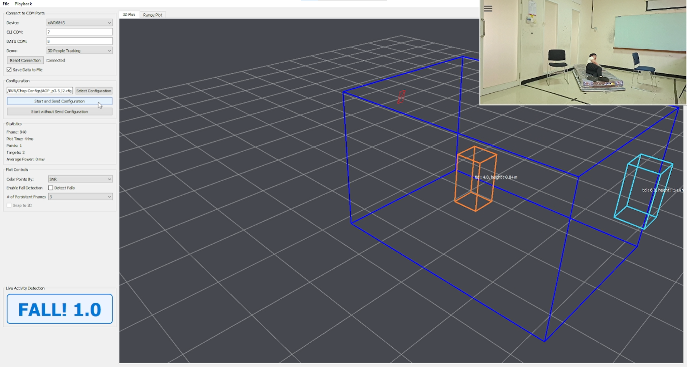

# Real-Time Fall Detection System with TTSNet

This repository implements a **real-time fall detection system** using **TTSNet**, a deep learning model designed to capture temporal features for human activity recognition. The system is intended for applications such as elderly monitoring, healthcare assistance, and smart surveillance.

## Features
- Real-time fall detection
- Deep learning-based TTSNet model
- Utilizes Texas Instruments' IWR6843AOPEVM radar
- Lightweight and modular implementation

## Usage
1. Connect the **IWR6843AOPEVM** radar sensor to your system.
2. Run main.py

## Usage Example
1. During non-fall activity

2. During fall activity

## Note
This project was developed as part of **Garry Nelson’s bachelor’s thesis**. The implementation represents a research prototype and may contain limitations. Further improvements, optimizations, and extensions are possible and encouraged.

[notgarryy]
